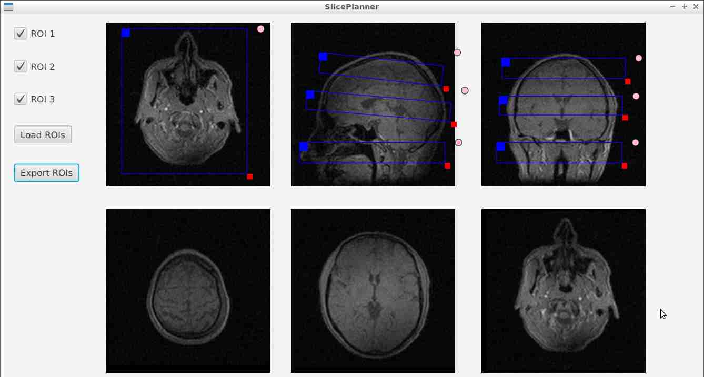

# SlicePlanner

GUI for prescribing one (or more) slabs off of a stack of 2D images. 
Primary goal is to emulate the slice prescription experience on commercial MRI scanners.

Input: The file **Localizer.h5** containing a 3D image volume in HDF5 format. See ./LocalizerScan/.

Output: The file **ROI.h5** containing ROI parameters (size, location, rotation, offset from iso-center).

For Java install+use notes, see ./Doc/

